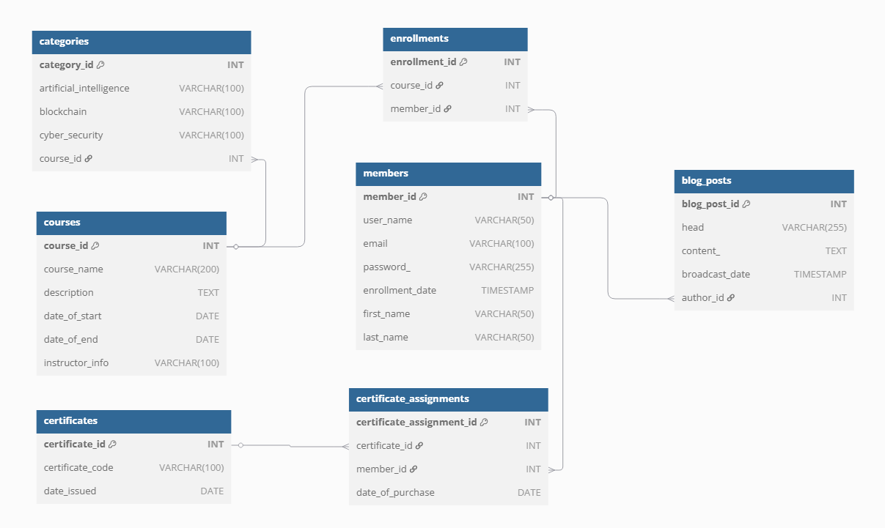

# 🎓 Online Education Platform - Veritabanı Projesi

Bu proje, çevrim içi bir eğitim platformunun temel veritabanı yapısını temsil etmektedir. Kullanıcılar (üyeler) sisteme kayıt olabilir, kurslara katılabilir, sertifikalar alabilir ve blog yazıları yayınlayabilirler. Aynı zamanda kurslar kategorilere ayrılabilir.

## 🧱 Veritabanı Yapısı

Projede toplam yedi adet tablo bulunmaktadır:

- **members**: Kullanıcı bilgilerini içerir.
- **courses**: Platformdaki eğitim kurslarını tanımlar.
- **categories**: Kursları yapay zeka, blokzincir ve siber güvenlik gibi kategorilere ayırır.
- **enrollments**: Hangi üyenin hangi kursa kayıtlı olduğunu gösterir.
- **certificates**: Kurs sonunda verilen sertifikaları tutar.
- **certificate_assignments**: Sertifikaların kullanıcılara atanmasını sağlar.
- **blog_posts**: Üyeler tarafından yazılan blog içeriklerini barındırır.

Bu tablolar arasında birincil ve yabancı anahtarlar aracılığıyla ilişkiler kurulmuştur. Böylece veri bütünlüğü sağlanır.

## 🖼️ Görsel Şema

Aşağıda veritabanı şemasını görsel olarak inceleyebilirsiniz:

